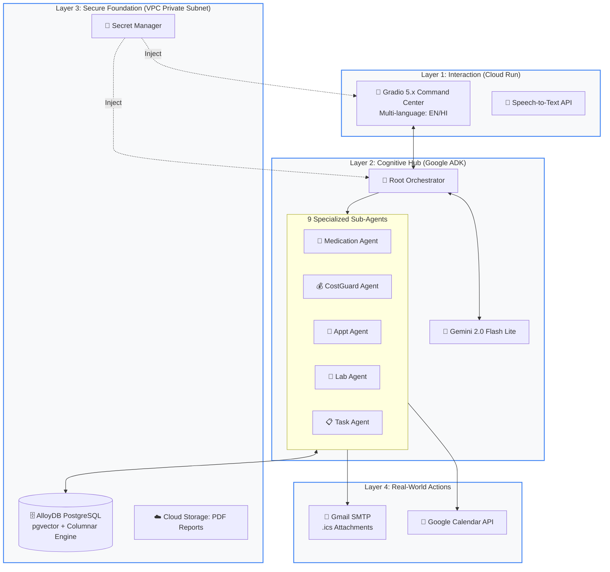
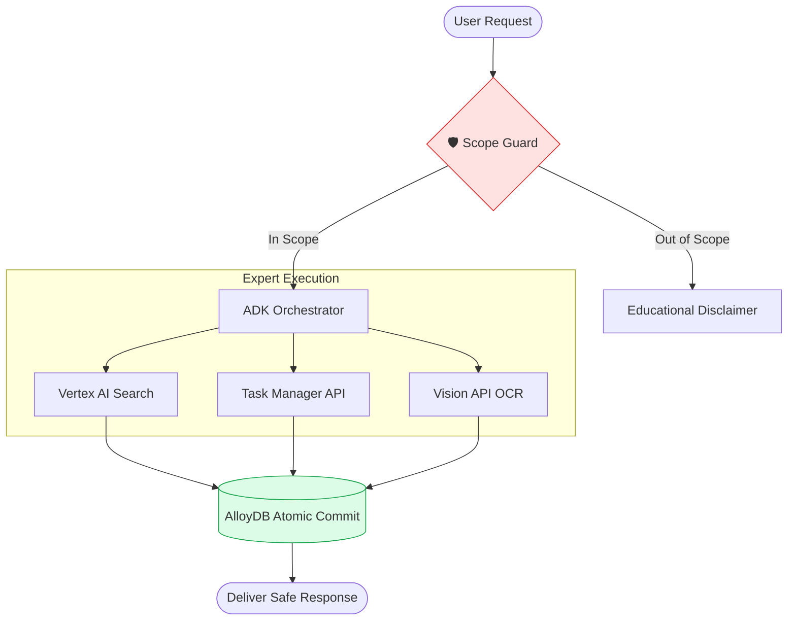
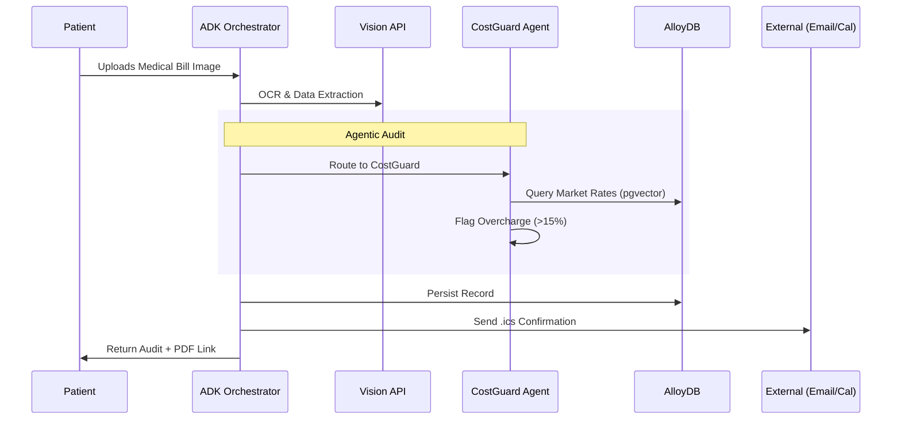

# 🌸 IVF Care Platform: Intelligent Care Coordination

> **Build in APAC. Build for the World.**  
> A production-grade, multi-agent cognitive hub designed to solve the global IVF coordination crisis using the Google Cloud AI ecosystem.

[](https://ivf-advisor-100876575377.us-central1.run.app)
[](https://task-manager-api-100876575377.us-central1.run.app/docs)
[](https://cloud.google.com)

---

## 🎯 The Vision: Solving the "Last Mile" of IVF

IVF is a medically complex journey where timing is critical. Patients currently face a "fragmented care gap" where missing a single 11:30 PM trigger shot can cancel a cycle. **IVF Care Platform** bridges this gap by moving beyond "Chatbots" into **Autonomous Coordination**. It acts as a single intelligent companion that interprets reports, audits costs, and coordinates nurses—all through a secure, grounded interface.

---

## 🏗️ System Architecture: The Cognitive Hub Model

The platform utilizes a **Layered Cognitive Hub** architecture. This model uses a central "Root Orchestrator" to delegate tasks to 9 domain-specific expert agents, ensuring clinical safety and system reliability.



---

## 🛡️ Innovation Highlights

### 1. Safety-First "Scope Guard"

Medical AI requires strict boundaries. Every request passes through a **Scope Guard Agent** that validates domain adherence and detects emergencies before the LLM processes the intent.



### 2. Multimodal Lab Interpretation

Utilizing **Google Vision API**, patients can upload physical lab reports. The system extracts key values (AMH, FSH, AFC) and interprets them using plain language grounded in Vertex AI Search citations.

### 3. CostGuard: Patient Financial Protection

The platform benchmarks clinic quotes against real-time market rates for 11+ Indian cities. If a clinic overcharges by more than 15%, the system flags the record and generates an insurance-ready audit summary.

---

## 🤖 Multi-Agent Coordination Flow

This demonstrates a complex, autonomous coordination: Patient uploads a bill → AI audits the cost → AI schedules a follow-up → AI syncs the calendar.



---

## 🛠️ Enterprise Technology Stack

| Layer | Technology | Purpose |
|-------|-----------|---------|
| **Agent Hub** | Google ADK | Complex session state and tool orchestration |
| **Brain** | Gemini 2.0 Flash Lite | High-speed reasoning with enterprise SLAs |
| **Database** | AlloyDB PostgreSQL | Concurrent multi-agent writes + native vector search |
| **Security** | Secret Manager | Zero-trust credential management |
| **Network** | VPC Direct Egress | Private data path for patient privacy |
| **UI** | Gradio 5.x | High-density clinical command center |

---

## 📁 Project Structure

```
ivf-care-platform/
├── ivf_advisor/      # Cloud Run Service 1: UI & Orchestration
│   ├── tools/        # 29 specialized tools (OCR, PDF, Evidence)
│   └── agent.py      # ADK agent logic
├── task_manager/     # Cloud Run Service 2: Multi-agent execution
│   ├── agents/       # 9 domain-specific sub-agents
│   └── db/           # AlloyDB connection & pgvector search
├── cloudbuild.yaml   # Parallel CI/CD pipeline
└── pyproject.toml    # Dependencies & project metadata
```

---

**Built by:** Vikrant Khaiwal  
**Hackathon:** Google Cloud Gen AI Academy - APAC Edition  
**License:** MIT
