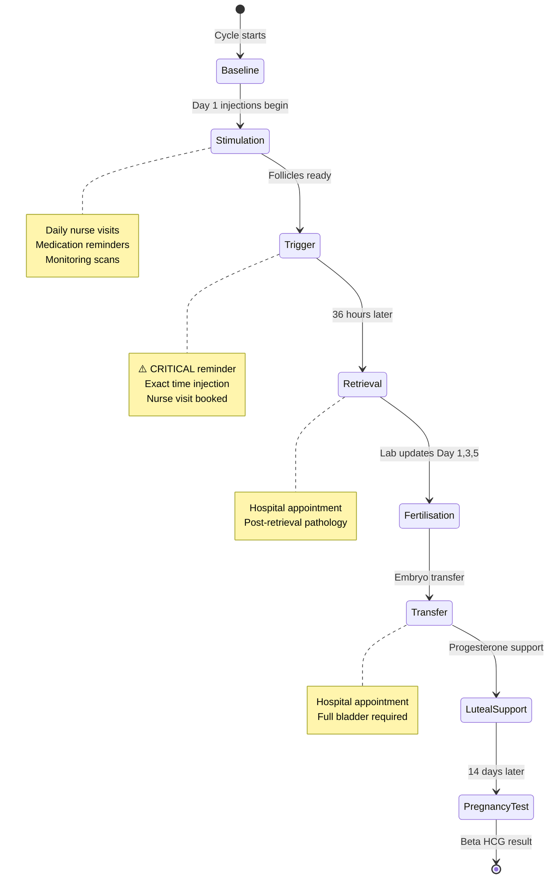
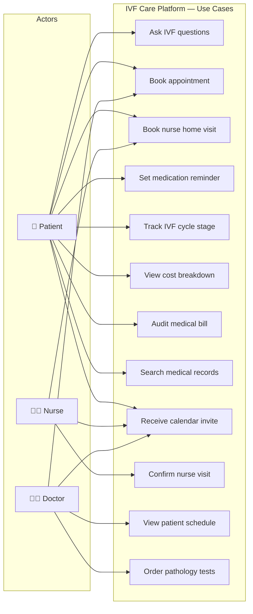
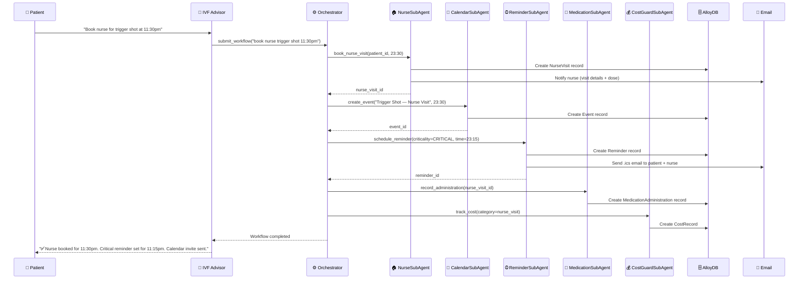
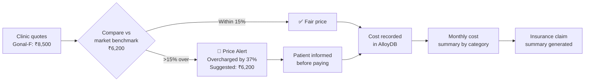

# 🌸 IVF Care Platform

> An AI-powered IVF care coordination platform — combining a conversational advisor with a multi-agent system to coordinate the full IVF journey for patients, nurses, and doctors.

[](https://ivf-advisor-100876575377.us-central1.run.app)
[](https://task-manager-api-100876575377.us-central1.run.app/docs)
[](https://cloud.google.com)

---

## 🎯 Problem Statement

IVF patients face:
- **Daily injections** requiring nurse home visits — hard to coordinate manually
- **Time-critical medications** (trigger shots) where missing a dose can cancel a cycle
- **Opaque costs** — patients are often overcharged with no way to verify
- **Fragmented information** — appointments, test results, medications tracked in different places

**IVF Care Platform** solves this with a single AI-powered interface.

---

## 🏗️ System Architecture

flowchart TD
    %% 1. Nodes & Decision
    Start([Start]) --> Chat[[Chat with AI Advisor]]
    Chat --> Q1{What does<br/>patient need?}

    %% 2. The Agent Layer
    Q1 -->|Clinical| Evidence[Evidence Search]
    Q1 -->|Booking| Appt[Appointment Agent]
    Q1 -->|Nursing| Nurse[Nurse Agent]
    Q1 -->|Medicine| Remind[Reminder Agent]
    Q1 -->|Costs| Cost[Cost Agent]
    Q1 -->|Schedule| Schedule[View Schedule]

    %% 3. Data & Storage
    Evidence & Appt & Nurse & Remind & Cost & Schedule --> AlloyDB[(AlloyDB)]
    AlloyDB --> Response[/Grounded Response/]

    %% 4. Communications
    Appt --> Email1[Appt Email]
    Nurse --> Email2[Nurse Email]
    Remind --> Email3[Remind Email]
    Email1 & Email2 & Email3 --> Calendar[Google Calendar]

    %% 5. GitHub-Optimized Classes
    classDef blue fill:#e1f5fe,stroke:#01579b,stroke-width:2px;
    classDef yellow fill:#fff9c4,stroke:#fbc02d,stroke-width:2px;
    classDef purple fill:#f3e5f5,stroke:#7b1fa2,stroke-width:2px;
    classDef teal fill:#e0f2f1,stroke:#00695c,stroke-width:2px;
    classDef green fill:#c8e6c9,stroke:#2e7d32,stroke-width:2px;
    classDef db fill:#01579b,stroke:#01579b,color:#fff;

    class Chat blue;
    class Q1 yellow;
    class Evidence,Appt,Nurse,Remind,Cost purple;
    class Schedule teal;
    class Response green;
    class AlloyDB db;
---

## 🏥 IVF Cycle Stage Tracking



---

## 👥 Use Case Diagram



---

## 🤖 Multi-Agent Coordination Example

> **Patient says:** *"Book a nurse for my trigger shot tonight at 11:30pm"*



---

## 💰 Cost Protection Flow



---

## 🛠️ Tech Stack

| Layer | Technology |
|---|---|
| Agent Framework | Google ADK |
| LLM | Gemini 2.5 Flash Lite (Vertex AI) |
| Chat UI | Gradio |
| REST API | FastAPI |
| Database | AlloyDB PostgreSQL |
| Vector Search | AlloyDB pgvector + text-embedding-004 |
| Evidence Search | Vertex AI Search |
| Deployment | Cloud Run (GCP) |
| CI/CD | Cloud Build |
| Secrets | Secret Manager |
| Email + Calendar | Gmail SMTP + .ics attachments |

---

## 🚀 Quick Start

```bash
# Clone
git clone https://github.com/khaiwalVikrant/ivf-care-platform.git
cd ivf-care-platform

# Install
pip install -e .

# Configure
cp .env.example .env
# Fill in GOOGLE_API_KEY, GOOGLE_CLOUD_PROJECT, VERTEX_SEARCH_DATASTORE_ID

# Run IVF Advisor UI
python -m ivf_advisor.ui

# Run Task Manager API (separate terminal)
python -m task_manager.main

# Run tests
pytest tests/ -v
```

---

## 📁 Project Structure

```
ivf-care-platform/
├── ivf_advisor/              # Conversational IVF advisor
│   ├── agent.py              # ADK agent + all tools
│   ├── orchestrator.py       # Session management
│   ├── ui.py                 # Gradio chat UI
│   └── tools/                # 7 tools including task_manager_client
├── task_manager/             # Multi-agent coordination platform
│   ├── agents/               # 9 specialized sub-agents
│   ├── api/app.py            # 20+ REST endpoints
│   ├── db/                   # AlloyDB facade + vector search
│   └── orchestrator.py       # Workflow engine with rollback
├── tests/
│   ├── unit/                 # 86 unit tests
│   └── property/             # Hypothesis property-based tests
├── Dockerfile.task_manager
├── ivf_advisor/Dockerfile
└── cloudbuild.yaml           # Parallel CI/CD pipeline
```

---

## 📄 License

MIT
