# 🌸 IVF Care Platform

> An AI-powered IVF care coordination platform — combining a conversational advisor with a multi-agent system to coordinate the full IVF journey for patients, nurses, and doctors.

[](https://ivf-advisor-100876575377.us-central1.run.app)
[](https://task-manager-api-100876575377.us-central1.run.app/docs)
[](https://cloud.google.com)

---

## ✨ Key Features

### 🤖 Conversational AI Advisor
- **Multi-language support** - English & Hindi (Devanagari script)
- **Evidence-based responses** - Grounded in ESHRE/ASRM/NICE/ICMR guidelines via Vertex AI Search
- **Persistent sessions** - Firestore/AlloyDB-backed session storage survives Cloud Run restarts
- **Optional profile saving** - Save patient profile (age, diagnosis, history) for personalized guidance

### 🛠️ Specialized Tools (29 Total)

**Clinical Guidance Tools:**
1. **Lab Result Interpreter** - Plain-language AMH/FSH/AFC/sperm analysis interpretation
2. **Medical Report Image Upload** - OCR-powered image analysis for lab reports (JPG/PNG) using Google Vision API
3. **Treatment Timeline Generator** - Week-by-week IVF schedule with protocol support (antagonist/long/short)
4. **Success Rate Calculator** - Personalized estimates by age/diagnosis (SART/HFEA/ICMR data)
5. **Cost Breakdown** - City-level INR pricing for 11+ Indian cities + international
6. **Clinic Red Flag Checker** - Detect misleading claims & unrealistic promises
7. **Injection Training Guide** - Step-by-step subcutaneous/IM injection instructions with medication-specific guidance
8. **Wellness Guide** - Stage-specific diet/exercise/lifestyle recommendations for both partners
9. **Emotional Support** - Empathy-first responses with crisis helpline resources
10. **Evidence Search** - Clinical guideline lookup via Vertex AI Search (ESHRE/ASRM/NICE/ICMR)
11. **Journey Stage Tracking** - Visual progress through IVF cycle phases
12. **PDF Report Generation** - Downloadable personalized IVF treatment plan with real conversation data

**Task Management & Coordination Tools:**
13. **Create Task** - Track to-do items and follow-up actions
14. **Schedule Reminder** - Set medication/injection/appointment reminders with criticality levels
15. **Book Appointment** - Schedule consultations, ultrasounds, retrievals, transfers
16. **Book Nurse Visit** - Home visit coordination for injections
17. **Get Cost Summary** - Retrieve cost breakdown for a patient's IVF cycle
18. **Track Expense** - Log IVF-related expenses (consultations, medications, procedures)
19. **Submit Workflow** - Multi-agent coordination for complex multi-step requests
20. **Get Schedule** - View all upcoming tasks, reminders, and appointments
21. **Get Workflow Status** - Check status of submitted workflows
22. **Semantic Search** - Natural language search across notes and test results

**Communication & Calendar Tools:**
23. **Add to Calendar** - Create Google Calendar events with .ics attachments
24. **Book Nurse Visit with Calendar** - Combined nurse booking + calendar integration
25. **Book Appointment with Calendar** - Combined appointment booking + calendar integration
26. **Send Appointment Confirmation** - Email confirmations to patient and doctor
27. **Send Nurse Visit Notification** - Email notifications to patient and nurse
28. **Send Reminder Notification** - Email reminders with .ics calendar attachments
29. **Scope Guard** - Query validation to ensure questions are within IVF/fertility domain

### 💰 Cost Protection
- **City-specific pricing** - Mumbai, Delhi, Bangalore, Chennai, Hyderabad, Pune, Kolkata, Ahmedabad, Jaipur, Chandigarh, Kochi
- **Overcharge detection** - Benchmark clinic quotes against market rates
- **Insurance claim support** - Structured cost summaries for reimbursement

### 🏥 Multi-Agent Coordination
- **9 specialized sub-agents** - Appointment, Calendar, Cost Guard, Medication, Notes, Nurse, Pathology, Reminder, Task Manager
- **Workflow orchestration** - Atomic operations with automatic rollback on failure
- **Email + Calendar integration** - Automated .ics invites for appointments, nurse visits, reminders
- **Task Manager API** - 20+ REST endpoints for external integrations
- **AlloyDB backend** - PostgreSQL with pgvector for semantic search
- **Real-time coordination** - Trigger shots, nurse visits, medication timing

### 🎨 Professional UI
- **Purple-pink gradient theme** - Compassionate, patient-friendly design matching IVF care context
- **Responsive layout** - Optimized for mobile (320px+), tablet (768px+), desktop (1366px+)
- **Real-time agent activity** - Visual feedback showing which agent is processing (with pulse animation)
- **Journey progress bar** - 5-stage IVF cycle visualization (Baseline → Stimulation → Retrieval → Transfer → Result)
- **Quick action buttons** - 6 one-click shortcuts in left sidebar for common tasks
- **Medical disclaimer banner** - Industry-standard compliance (soft purple, always visible)
- **Multi-language support** - Language selector for English/Hindi with instant switching
- **Voice input** - Speech-to-text for hands-free interaction
- **Image upload** - 📸 Upload medical reports (JPG/PNG) for instant OCR analysis and interpretation
- **PDF download** - One-click personalized IVF plan generation with actual conversation data
- **Session persistence** - Conversations survive Cloud Run restarts via Firestore

### UI Layout & Mockup

```mermaid
%%{init: {
  'theme': 'base',
  'themeVariables': {
    'primaryColor': '#f5f3ff',
    'primaryTextColor': '#7c3aed',
    'primaryBorderColor': '#7c3aed',
    'lineColor': '#e5e7eb',
    'secondaryColor': '#ffffff',
    'tertiaryColor': '#fdf2f8'
  }
}}%%

graph TB
    subgraph UI["🖥️ IVF Care Platform - Three-Column Command Center Layout"]
        
        subgraph LeftSidebar["📌 Left Sidebar (200px)<br/>━━━━━━━━━━━━━━━━━━━━"]
            LOGO["🌸 <b>IVF Care Platform</b><br/><i>Your AI Companion</i>"]
            NEWCONV["<b>➕ New Conversation</b><br/>(Dashed border button)"]
            
            LANG["<b>🌍 Language Selector</b><br/>○ English  ● हिंदी"]
            
            QUICKTITLE["<b>⚡ QUICK ACTIONS</b>"]
            Q1["🧬 Lab Results<br/><i>Interpret AMH/FSH</i>"]
            Q2["📅 Timeline<br/><i>Treatment schedule</i>"]
            Q3["💊 Injections<br/><i>Self-admin guide</i>"]
            Q4["💰 Mumbai Costs<br/><i>City pricing</i>"]
            Q5["📊 Success Rates<br/><i>Age-based stats</i>"]
            Q6["🥗 Wellness<br/><i>Diet & lifestyle</i>"]
            
            STATUS["<b>📊 Session Status</b><br/>🟢 Active Session"]
            AGENT["<b>🤖 Agent Activity</b><br/>💭 Analyzing lab results...<br/>(Pulse animation)"]
        end
        
        subgraph CenterColumn["💬 Center Column (Flex Grow)<br/>━━━━━━━━━━━━━━━━━━━━━━━━━━━━━━━━━━━━━━"]
            HEADER["<b>IVF Care Advisor</b><br/><i>Evidence-based guidance for your fertility journey</i>"]
            
            DISCLAIMER["⚠️ <b>Medical Disclaimer:</b> This is informational guidance only.<br/>Always consult your fertility specialist for medical decisions."]
            
            CHATAREA["<b>💬 Chat Messages</b><br/>━━━━━━━━━━━━━━━━━━━━━━━━━━━━━━━━━━━━━━<br/><br/><b>Bot:</b> Welcome! I can help you understand<br/>lab results, plan timelines, and coordinate care.<br/><br/><b>User:</b> I just got my AMH test results.<br/>Can you help me understand them?<br/><br/><b>Bot:</b> Of course! You can either:<br/>• Upload an image of your report 📸<br/>• Tell me the values directly<br/><br/><b>User:</b> [Uploaded: Blood_Test_Report.jpg]<br/><br/><b>Bot:</b> 🔍 Analyzing your report...<br/><br/>I can see your AMH is 2.8 ng/mL.<br/>This indicates <b>good ovarian reserve</b>.<br/><br/>Would you like me to:<br/>• Explain what this means for IVF success<br/>• Create a treatment timeline<br/>• Show cost estimates for your city"]
            
            CHIPS["<b>💡 Quick Prompts:</b><br/>🔘 Explain my results  🔘 Create timeline<br/>🔘 Show costs  🔘 Book appointment"]
            
            INPUTAREA["<b>📝 Input Area</b><br/>━━━━━━━━━━━━━━━━━━━━━━━━━━━━━━━━━━━━━━<br/>[Type your message here...]<br/>📸 Image  🎤 Voice  ➤ Send"]
            
            IMGACCORDION["<b>▼ 📸 Upload Medical Report (Optional)</b><br/>Drag & drop or click to upload JPG/PNG<br/><i>Supports: Lab reports, prescriptions, ultrasounds</i>"]
            
            CONTEXTUAL["<b>💾 Save Profile</b>  |  <b>📄 Download PDF Report</b><br/>(Contextual buttons - appear when relevant)"]
        end
        
        subgraph RightSidebar["📊 Right Sidebar (200px)<br/>━━━━━━━━━━━━━━━━━━━━"]
            JOURNEYTITLE["<b>🧬 JOURNEY PROGRESS</b>"]
            
            J1["● <b>Baseline</b><br/><i>Day 1-3</i>"]
            J2["◉ <b>Stimulation</b><br/><i>Day 2-12 (Current)</i>"]
            J3["○ <b>Trigger Shot</b><br/><i>Day 13</i>"]
            J4["○ <b>Retrieval</b><br/><i>Day 15</i>"]
            J5["○ <b>Transfer</b><br/><i>Day 18-20</i>"]
            
            DOCSTITLE["<b>📚 DOCUMENTS & SUPPORT</b>"]
            
            D1["📄 ESHRE Guidelines"]
            D2["📄 ASRM Standards"]
            D3["📄 NICE Protocols"]
            D4["📄 ICMR Guidelines"]
            
            SUPPORTTITLE["<b>🆘 CRISIS SUPPORT</b>"]
            
            S1["🇮🇳 India: 9152987821"]
            S2["🇬🇧 UK: 116 123"]
            S3["🌍 Global: befrienders.org"]
            
            SOURCESTITLE["<b>🔬 EVIDENCE SOURCES</b>"]
            
            SRC1["📊 SART 2023 Data"]
            SRC2["📊 HFEA Success Rates"]
            SRC3["📊 ICMR Registry"]
            
            BENTOTITLE["<b>🎴 QUICK CARDS</b>"]
            
            B1["💰 Cost Calculator<br/><i>City-specific pricing</i>"]
            B2["🚩 Red Flag Checker<br/><i>Clinic claims audit</i>"]
            B3["📧 Email Reminders<br/><i>Never miss a dose</i>"]
        end
    end
    
    subgraph Responsive["📱 Responsive Breakpoints"]
        DESKTOP["<b>🖥️ Desktop (1366px+)</b><br/>All 3 columns visible<br/>Full feature set"]
        TABLET["<b>📱 Tablet (768-1100px)</b><br/>Left + Center columns<br/>Right sidebar hidden"]
        MOBILE["<b>📱 Mobile (320-767px)</b><br/>Center column only<br/>Sidebars hidden<br/>Hamburger menu"]
    end
    
    LeftSidebar -.-> DESKTOP
    CenterColumn -.-> DESKTOP
    RightSidebar -.-> DESKTOP
    
    LeftSidebar -.-> TABLET
    CenterColumn -.-> TABLET
    
    CenterColumn -.-> MOBILE

    classDef sidebar fill:#f5f3ff,stroke:#7c3aed,stroke-width:2px,color:#5b21b6
    classDef center fill:#ffffff,stroke:#e5e7eb,stroke-width:2px,color:#1f2937
    classDef right fill:#fdf2f8,stroke:#db2777,stroke-width:2px,color:#831843
    classDef responsive fill:#dbeafe,stroke:#3b82f6,stroke-width:2px,color:#1e40af
    
    class LeftSidebar,LOGO,NEWCONV,LANG,QUICKTITLE,Q1,Q2,Q3,Q4,Q5,Q6,STATUS,AGENT sidebar
    class CenterColumn,HEADER,DISCLAIMER,CHATAREA,CHIPS,INPUTAREA,IMGACCORDION,CONTEXTUAL center
    class RightSidebar,JOURNEYTITLE,J1,J2,J3,J4,J5,DOCSTITLE,D1,D2,D3,D4,SUPPORTTITLE,S1,S2,S3,SOURCESTITLE,SRC1,SRC2,SRC3,BENTOTITLE,B1,B2,B3 right
    class DESKTOP,TABLET,MOBILE responsive
```

### Detailed UI Component Breakdown

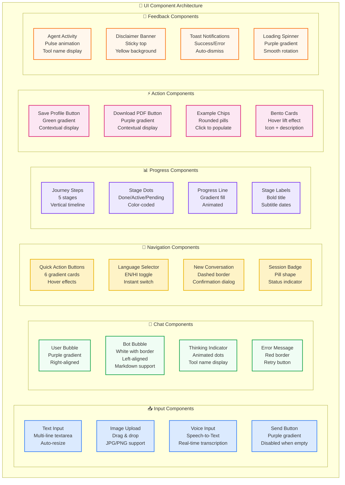

---

## 🎯 Problem Statement

IVF patients face:
- **Daily injections** requiring nurse home visits — hard to coordinate manually
- **Time-critical medications** (trigger shots) where missing a dose can cancel a cycle
- **Opaque costs** — patients are often overcharged with no way to verify
- **Fragmented information** — appointments, test results, medications tracked in different places

**IVF Care Platform** solves this with a single AI-powered interface.

---

## 🏗️ System Architecture

### 1. High-Level Tiered Architecture

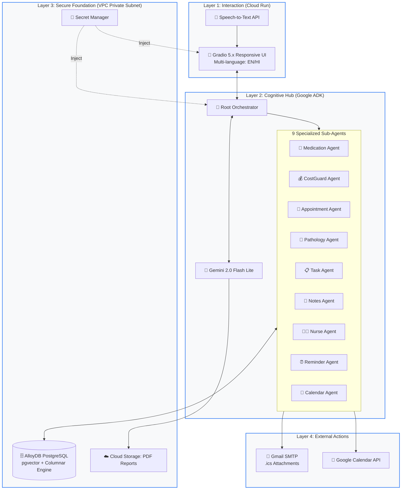

---

## 🤖 Multi-Agent Coordination & Image OCR Flow

> **Example:** Patient uploads medical bill → CostGuard Agent audits pricing → Email confirmation sent

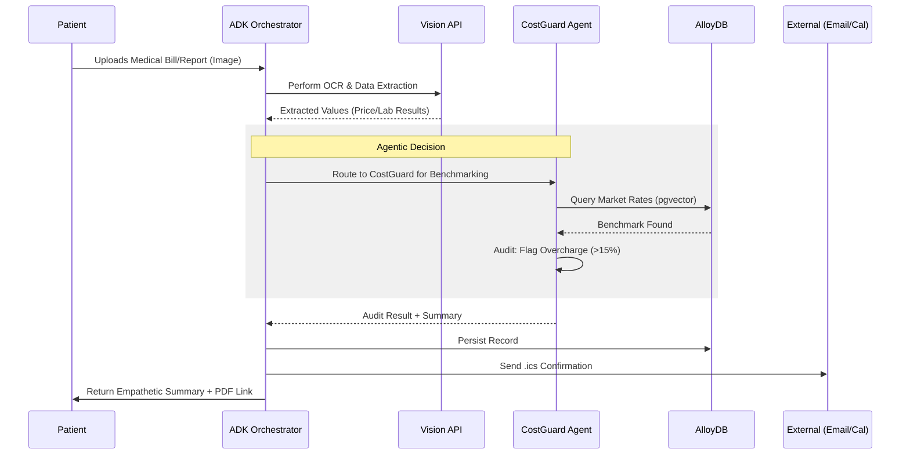

---

## 🛡️ Integrated Process Flow (Safety-First Journey)

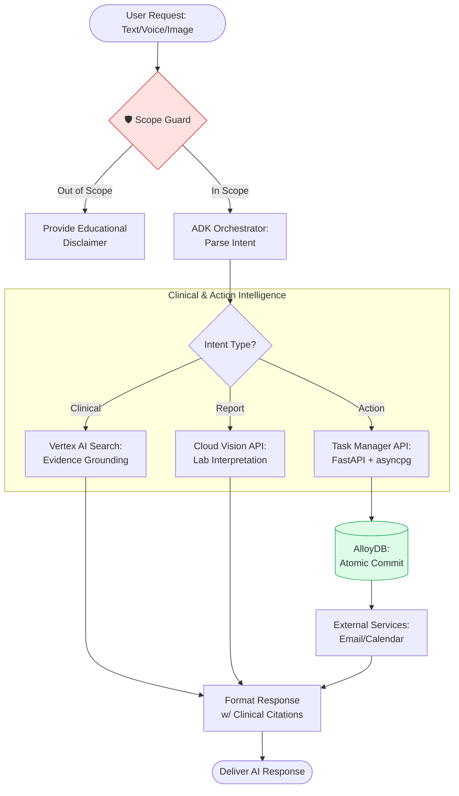

---

## 🗄️ Database Schema (AlloyDB with pgvector)

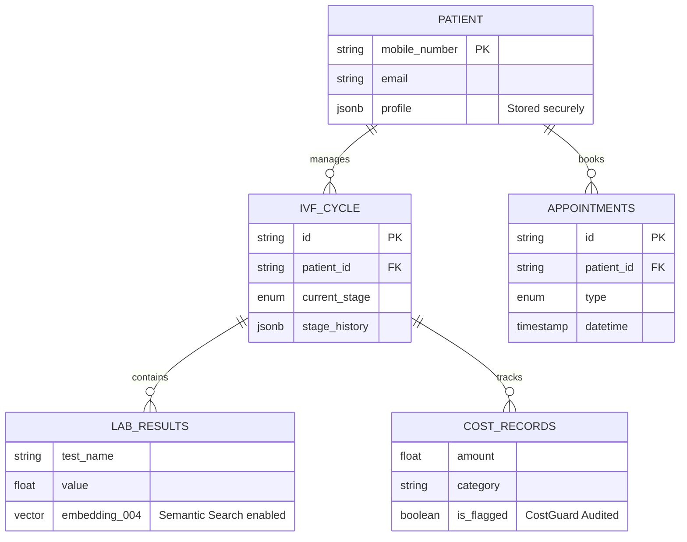

---

## 🛠️ Tech Stack

| Layer | Technology |
|---|---|
| **Agent Framework** | Google ADK (Agent Development Kit) |
| **LLM** | Gemini 2.0 Flash Lite (Vertex AI) |
| **Chat UI** | Gradio 5.x |
| **REST API** | FastAPI |
| **Primary Database** | AlloyDB for PostgreSQL |
| **Session Storage** | Firestore (default) / AlloyDB (optional) |
| **Vector Search** | AlloyDB pgvector + Vertex AI text-embedding-004 |
| **Evidence Search** | Vertex AI Search (Discovery Engine) |
| **OCR & Image Analysis** | Google Cloud Vision API |
| **PDF Generation** | ReportLab 4.0+ |
| **File Storage** | Google Cloud Storage |
| **Speech-to-Text** | Google Cloud Speech-to-Text API |
| **Email** | Gmail SMTP |
| **Calendar** | Google Calendar API + .ics attachments |
| **Deployment** | Cloud Run (GCP) - 2 services |
| **CI/CD** | Cloud Build (parallel pipelines) |
| **Secrets Management** | Secret Manager |
| **Languages** | English, Hindi (Devanagari script) |
| **Python Version** | 3.11+ |

---
    SUBAGENTS --> GMAIL
    
    %% Layer 4 External
    GCAL --> USERCAL
    GMAIL --> USEREMAIL

    classDef layer1 fill:#f0f9ff,stroke:#0369a1,stroke-width:3px,color:#0c4a6e
    classDef layer2 fill:#f5f3ff,stroke:#7c3aed,stroke-width:3px,color:#5b21b6
    classDef layer3 fill:#f0fdf4,stroke:#15803d,stroke-width:3px,color:#14532d
    classDef layer4 fill:#fef3c7,stroke:#ca8a04,stroke-width:3px,color:#854d0e
    
    class UI,STT,VISION layer1
    class ORCH,GEMINI,TOOLS,SEARCH,SUBAGENTS layer2
    class ALLOY,FIRESTORE,GCS,SECRET layer3
    class GCAL,GMAIL,USERCAL,USEREMAIL layer4
```

### Technology Stack by Layer

| Layer | Component | Technology | Purpose |
|-------|-----------|-----------|---------|
| **🌐 Layer 1** | UI | Gradio 5.x | Responsive chat interface |
| | Speech | Speech-to-Text API | Voice input transcription |
| | Vision | Cloud Vision API | Medical report OCR |
| **🧠 Layer 2** | Agent Framework | Google ADK | Agent orchestration |
| | LLM | Gemini 2.0 Flash Lite | Natural language understanding |
| | Tools | 29 custom tools | Clinical + coordination + communication |
| | Evidence | Vertex AI Search | Research paper discovery |
| | Sub-Agents | FastAPI | Multi-agent coordination |
| **🔒 Layer 3** | Database | AlloyDB PostgreSQL | Primary data store + pgvector |
| | Session Store | Firestore | Session persistence |
| | File Storage | Cloud Storage | PDF reports + images |
| | Secrets | Secret Manager | Zero-trust credential management |
| **🌍 Layer 4** | Calendar | Google Calendar API | Event scheduling |
| | Email | Gmail SMTP | Notifications + .ics attachments |
| | User Services | External | Patient-facing integrations |

---

### Complete Interaction Flow

```mermaid
%%{init: {
  'theme': 'base',
  'themeVariables': {
    'primaryColor': '#eff6ff',
    'primaryTextColor': '#1e40af',
    'primaryBorderColor': '#3b82f6',
    'lineColor': '#64748b',
    'secondaryColor': '#f8fafc',
    'tertiaryColor': '#f1f5f9'
  }
}}%%

graph TD
    %% Interaction Entry Points
    Start([👤 Patient Interaction]) --> InputType{Input Type?}
    
    InputType -->|Text| TextInput[💬 Text Message]
    InputType -->|Voice| VoiceInput[🎤 Voice Input]
    InputType -->|Image| ImageInput[📸 Medical Report Upload]
    
    VoiceInput -->|Speech-to-Text API| TextInput
    ImageInput -->|Vision API OCR| ExtractedData[📄 Extracted Lab Values]
    
    %% Scope Guard & Validation
    TextInput --> ScopeGuard{🛡️ Scope Guard<br/>Domain Check}
    ExtractedData --> ScopeGuard
    
    ScopeGuard -->|Out of Scope| OutScope[❌ Polite Decline<br/>+ Referral Suggestion]
    ScopeGuard -->|Emergency| Emergency[🚨 Emergency Response<br/>Seek Immediate Care]
    ScopeGuard -->|In Scope| SessionCheck{Session<br/>Exists?}
    
    %% Session Management
    SessionCheck -->|New| Onboarding[📋 Onboarding Flow<br/>Mobile → Lookup/Register<br/>Profile Opt-in]
    SessionCheck -->|Existing| LoadSession[📂 Load Session<br/>Firestore/AlloyDB<br/>patient_id, cycle_id]
    
    Onboarding --> LoadSession
    LoadSession --> InjectContext[💉 Inject Patient Context<br/>patient_id, cycle_id<br/>patient_name, email]
    
    %% ADK Agent Processing
    InjectContext --> ADK[🤖 ADK Agent<br/>Gemini 2.0 Flash Lite<br/>Parse Intent]
    
    ADK --> RouteIntent{Route to<br/>Tool Category?}
    
    %% Clinical Tools (12)
    RouteIntent -->|Clinical| ClinicalTools{Clinical<br/>Tool?}
    ClinicalTools -->|Lab Results| T1[Lab Result<br/>Interpreter]
    ClinicalTools -->|Image Analysis| T2[Image Analyzer<br/>Vision API]
    ClinicalTools -->|Timeline| T3[Timeline<br/>Generator]
    ClinicalTools -->|Success Rates| T4[Success Rate<br/>Calculator]
    ClinicalTools -->|Costs| T5[Cost Breakdown<br/>11+ Cities]
    ClinicalTools -->|Red Flags| T6[Red Flag<br/>Checker]
    ClinicalTools -->|Injections| T7[Injection<br/>Guide]
    ClinicalTools -->|Wellness| T8[Wellness<br/>Guide]
    ClinicalTools -->|Emotional| T9[Emotional<br/>Support]
    ClinicalTools -->|Evidence| T10[Evidence Search<br/>Vertex AI Search]
    ClinicalTools -->|Journey| T11[Journey Stage<br/>Tracker]
    ClinicalTools -->|PDF| T12[PDF Report<br/>Generator]
    
    %% Coordination Tools (10)
    RouteIntent -->|Coordination| CoordTools{Coordination<br/>Tool?}
    CoordTools -->|Task| T13[Create<br/>Task]
    CoordTools -->|Reminder| T14[Schedule<br/>Reminder]
    CoordTools -->|Appointment| T15[Book<br/>Appointment]
    CoordTools -->|Nurse| T16[Book Nurse<br/>Visit]
    CoordTools -->|Cost Summary| T17[Get Cost<br/>Summary]
    CoordTools -->|Expense| T18[Track<br/>Expense]
    CoordTools -->|Workflow| T19[Submit<br/>Workflow]
    CoordTools -->|Schedule| T20[Get<br/>Schedule]
    CoordTools -->|Status| T21[Get Workflow<br/>Status]
    CoordTools -->|Search| T22[Semantic<br/>Search]
    
    %% Communication Tools (7)
    RouteIntent -->|Communication| CommTools{Communication<br/>Tool?}
    CommTools -->|Calendar| T23[Add to<br/>Calendar]
    CommTools -->|Nurse+Cal| T24[Nurse Visit<br/>+ Calendar]
    CommTools -->|Appt+Cal| T25[Appointment<br/>+ Calendar]
    CommTools -->|Appt Email| T26[Send Appt<br/>Confirmation]
    CommTools -->|Nurse Email| T27[Send Nurse<br/>Notification]
    CommTools -->|Reminder Email| T28[Send Reminder<br/>Notification]
    
    %% Tool Execution & Data Flow
    T1 & T2 & T3 & T4 & T5 & T6 & T7 & T8 & T9 & T11 --> Gemini[Gemini 2.0<br/>Flash Lite]
    T10 --> VertexSearch[Vertex AI<br/>Search]
    T12 --> GCS[Cloud Storage<br/>PDF Files]
    
    T13 & T14 & T15 & T16 & T17 & T18 & T19 & T20 & T21 --> TaskAPI[Task Manager<br/>API]
    T22 --> PGVector[AlloyDB<br/>pgvector]
    
    T23 & T24 & T25 --> GCal[Google<br/>Calendar API]
    T26 & T27 & T28 --> Gmail[Gmail<br/>SMTP]
    
    %% Data Persistence
    TaskAPI --> AlloyDB[(AlloyDB<br/>PostgreSQL)]
    Gemini --> Response[📝 Format Response<br/>+ Medical Disclaimer]
    VertexSearch --> Response
    GCS --> Response
    PGVector --> Response
    AlloyDB --> Response
    
    %% Communication Outputs
    GCal --> CalInvite[📅 .ics Calendar<br/>Attachment]
    Gmail --> EmailNotif[📧 Email<br/>Notification]
    
    CalInvite --> Response
    EmailNotif --> Response
    
    %% Session Update & Output
    Response --> UpdateSession[💾 Update Session<br/>Topics, Turn Count<br/>Save to Firestore/AlloyDB]
    UpdateSession --> Output[💬 Display Response<br/>to Patient]
    
    Output --> End([✅ End])
    OutScope --> End
    Emergency --> End

    %% Styling
    classDef input fill:#dbeafe,stroke:#3b82f6,stroke-width:2px
    classDef guard fill:#fee2e2,stroke:#dc2626,stroke-width:2px
    classDef session fill:#fef3c7,stroke:#eab308,stroke-width:2px
    classDef agent fill:#ede9fe,stroke:#7c3aed,stroke-width:2px
    classDef clinical fill:#dcfce7,stroke:#16a34a,stroke-width:2px
    classDef coord fill:#dbeafe,stroke:#3b82f6,stroke-width:2px
    classDef comm fill:#fce7f3,stroke:#db2777,stroke-width:2px
    classDef data fill:#f1f5f9,stroke:#64748b,stroke-width:2px
    classDef output fill:#f0fdf4,stroke:#22c55e,stroke-width:2px
    
    class Start,InputType,TextInput,VoiceInput,ImageInput,ExtractedData input
    class ScopeGuard,OutScope,Emergency guard
    class SessionCheck,Onboarding,LoadSession,InjectContext session
    class ADK,RouteIntent agent
    class ClinicalTools,T1,T2,T3,T4,T5,T6,T7,T8,T9,T10,T11,T12 clinical
    class CoordTools,T13,T14,T15,T16,T17,T18,T19,T20,T21,T22 coord
    class CommTools,T23,T24,T25,T26,T27,T28 comm
    class Gemini,VertexSearch,GCS,TaskAPI,PGVector,AlloyDB,GCal,Gmail,CalInvite,EmailNotif data
    class Response,UpdateSession,Output,End output
```

### Simplified High-Level Flow

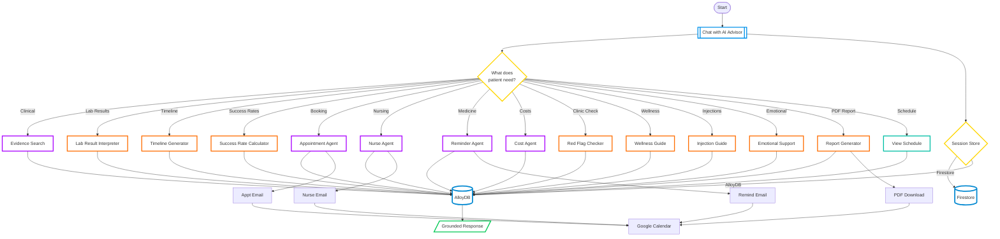
---

## 🏥 IVF Cycle Stage Tracking

```mermaid
%%{init: {
  'theme': 'base',
  'themeVariables': {
    'theme': 'neutral',
    'primaryColor': '#eff6ff',
    'primaryTextColor': '#1e40af',
    'primaryBorderColor': '#3b82f6',
    'lineColor': '#64748b',
    'secondaryColor': '#fff7ed',
    'tertiaryColor': '#f8fafc',
    'noteBkgColor': '#fef9c3',
    'noteTextColor': '#854d0e',
    'fontSize': '14px'
  }
} }%%

stateDiagram-v2
    direction TB

    state "🩸 Baseline" as Baseline
    state "💉 Stimulation" as Stimulation
    state "⏰ Trigger Shot" as Trigger
    state "🏥 Retrieval" as Retrieval
    state "🧪 Fertilisation" as Fertilisation
    state "🧬 Transfer" as Transfer
    state "💊 Luteal Support" as LutealSupport
    state "✨ Final Result" as PregnancyTest

    [*] --> Baseline
    
    Baseline --> Stimulation: Day 1 Injections
    note right of Stimulation
        <b>Daily Support</b>
        • Nurse visits
        • Med reminders
    end note

    Stimulation --> Trigger: Follicles Ready
    note right of Trigger
        <b>⚠️ CRITICAL</b>
        Exact timing is
        mandatory.
    end note

    Trigger --> Retrieval: 36h later
    
    Retrieval --> Fertilisation: Lab Phase
    note right of Fertilisation
        Status reports on
        Days 1, 3, and 5.
    end note

    Fertilisation --> Transfer: Embryo Selection
    note right of Transfer
        <b>Prep</b>
        • Hospital appt
        • 💧 Full bladder
    end note

    Transfer --> LutealSupport: Progesterone
    LutealSupport --> PregnancyTest: 14 Day Wait
    
    PregnancyTest --> [*]
```

---

## 👥 Use Case Diagram

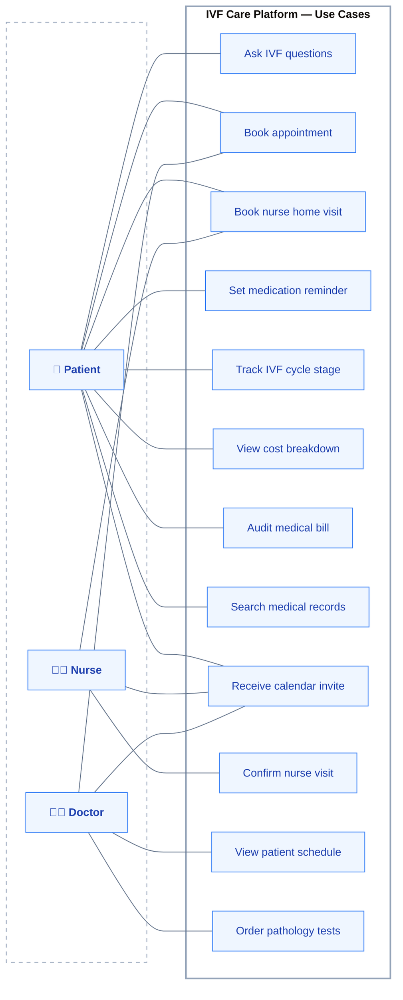

---

## 🤖 Multi-Agent Coordination Example

> **Patient says:** *"Book a nurse for my trigger shot tonight at 11:30pm"*

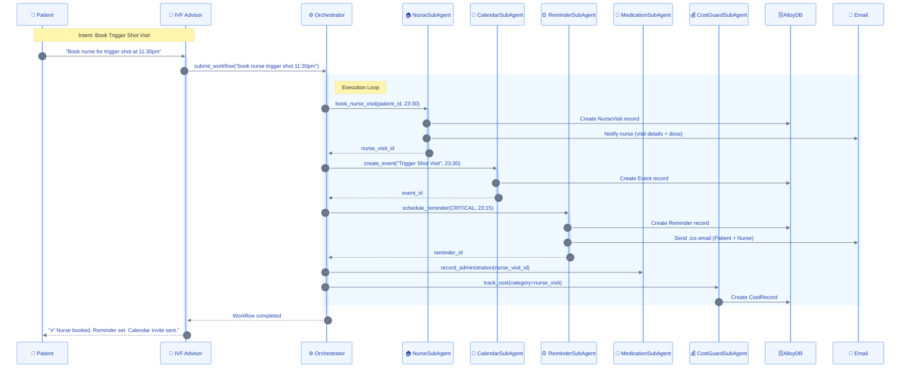

---

## 💰 Cost Protection Flow

```mermaid
%%{init: {
  'theme': 'base',
  'themeVariables': {
    'primaryColor': '#eff6ff',
    'primaryTextColor': '#1e40af',
    'primaryBorderColor': '#3b82f6',
    'lineColor': '#64748b',
    'secondaryColor': '#fef2f2',
    'tertiaryColor': '#f0fdf4',
    'mainBkg': '#ffffff',
    'nodeBorder': '#3b82f6',
    'clusterBkg': 'rgba(255, 255, 255, 0.05)',
    'fontSize': '14px'
  }
} }%%

flowchart LR
    %% Node Definitions
    Quote["📄 <b>Clinic Quote</b><br/>Gonal-F: ₹8,500"]
    Benchmark{"⚖️ <b>Benchmark</b><br/>Market: ₹6,200"}
    
    Alert[["🚨 <b>Price Alert</b><br/>Overcharged by 37%<br/>Suggested: ₹6,200"]]
    OK(["✅ <b>Fair Price</b><br/>Within Range"])
    
    Patient["👤 <b>Patient Informed</b><br/>Prior to Payment"]
    Record[("🗄️ <b>AlloyDB</b><br/>Cost Logged")]
    
    Summary["📊 <b>Monthly Summary</b><br/>Cost by Category"]
    Insurance["📝 <b>Insurance Claim</b><br/>Summary Generated"]

    %% Flow Connections
    Quote --> Benchmark

    Benchmark -- ">15% Over" --> Alert
    Benchmark -- "Within 15%" --> OK

    Alert --> Patient
    Patient --> Record
    OK --> Record

    Record --> Summary
    Summary --> Insurance

    %% Specific Styling for Logic Paths
    style Alert fill:#fff1f2,stroke:#e11d48,color:#9f1239
    style OK fill:#f0fdf4,stroke:#16a34a,color:#166534
    style Record fill:#f8fafc,stroke:#64748b
```

---

## 📸 Medical Report Image Upload Flow

> **Patient says:** *"I just got my lab results, let me upload the report"*

```mermaid
%%{init: {
  'theme': 'base',
  'themeVariables': {
    'primaryColor': '#eff6ff',
    'primaryTextColor': '#1e40af',
    'primaryBorderColor': '#3b82f6',
    'lineColor': '#64748b',
    'secondaryColor': '#f8fafc',
    'tertiaryColor': '#f1f5f9',
    'mainBkg': '#ffffff',
    'nodeBorder': '#3b82f6',
    'clusterBkg': 'rgba(255, 255, 255, 0.05)',
    'fontSize': '14px'
  }
} }%%

flowchart LR
    %% Node Definitions
    Upload["📸 <b>Upload Image</b><br/>Lab Report (JPG/PNG)"]
    Vision["🔍 <b>Google Vision API</b><br/>OCR Text Extraction"]
    
    Parse["🧬 <b>Parse Values</b><br/>AMH, FSH, AFC<br/>Sperm Analysis"]
    Interpret["💡 <b>Interpret</b><br/>Normal/Low/High<br/>Plain Language"]
    
    Response["💬 <b>AI Response</b><br/>Detailed Explanation<br/>+ Next Steps"]
    LabTool["🔬 <b>Lab Result Tool</b><br/>Deep Analysis"]

    %% Flow Connections
    Upload --> Vision
    Vision --> Parse
    Parse --> Interpret
    Interpret --> Response
    Response -.Optional.-> LabTool

    %% Styling
    style Upload fill:#fdf2f8,stroke:#db2777,color:#831843
    style Vision fill:#eff6ff,stroke:#3b82f6,color:#1e40af
    style Parse fill:#f0fdf4,stroke:#16a34a,color:#166534
    style Interpret fill:#fef9c3,stroke:#eab308,color:#854d0e
    style Response fill:#f5f3ff,stroke:#7c3aed,color:#5b21b6
```

**Supported Values:**
- **Female Fertility:** AMH, FSH, AFC, E2, LH, Progesterone
- **Male Fertility:** Sperm Count, Motility, Morphology, Volume
- **Auto-interpretation:** Instant classification (Low/Normal/High) with plain-language explanations

---

## 🛠️ Tech Stack

| Layer | Technology |
|---|---|
| **Agent Framework** | Google ADK (Agent Development Kit) |
| **LLM** | Gemini 2.0 Flash Lite (Vertex AI) |
| **Chat UI** | Gradio 5.x |
| **REST API** | FastAPI |
| **Primary Database** | AlloyDB for PostgreSQL |
| **Session Storage** | Firestore (default) / AlloyDB (optional) |
| **Vector Search** | AlloyDB pgvector + Vertex AI text-embedding-004 |
| **Evidence Search** | Vertex AI Search (Discovery Engine) |
| **OCR & Image Analysis** | Google Cloud Vision API |
| **PDF Generation** | ReportLab 4.0+ |
| **File Storage** | Google Cloud Storage |
| **Speech-to-Text** | Google Cloud Speech-to-Text API |
| **Email** | Gmail SMTP |
| **Calendar** | Google Calendar API + .ics attachments |
| **Deployment** | Cloud Run (GCP) - 2 services |
| **CI/CD** | Cloud Build (parallel pipelines) |
| **Secrets Management** | Secret Manager |
| **Languages** | English, Hindi (Devanagari script) |
| **Python Version** | 3.11+ |

---

## � Project Structure

```
ivf-care-platform/
├── ivf_advisor/                      # Conversational IVF advisor (Cloud Run service 1)
│   ├── agent.py                      # ADK agent with 29 tools registered
│   ├── orchestrator.py               # Session management + state machine
│   ├── ui.py                         # Gradio chat UI (responsive, multi-language, image upload)
│   ├── session.py                    # Session models + Firestore/AlloyDB stores
│   ├── config.py                     # Environment configuration
│   ├── patch_gradio.py               # Gradio customizations
│   ├── Dockerfile                    # Container image for IVF Advisor
│   ├── cloudbuild.yaml               # Cloud Build config
│   └── tools/                        # 29 specialized tools (clinical + coordination + communication)
│       ├── cost_breakdown.py         # City-level INR pricing (11+ Indian cities)
│       ├── email_notifications.py    # Email sending utility
│       ├── emotional_support.py      # Empathy-first responses + crisis helplines
│       ├── evidence_search.py        # Vertex AI Search integration
│       ├── google_calendar.py        # Calendar event creation
│       ├── image_analyzer.py         # Medical report OCR + interpretation (NEW)
│       ├── injection_guide.py        # Step-by-step injection instructions
│       ├── journey_guide.py          # IVF cycle stage guidance
│       ├── lab_result.py             # AMH/FSH/AFC interpreter
│       ├── red_flag.py               # Clinic claim checker
│       ├── report_generator.py       # PDF report generation (ReportLab)
│       ├── scope_guard.py            # Query scope validation
│       ├── speech_to_text.py         # Audio transcription
│       ├── success_rate.py           # Personalized success rate calculator
│       ├── task_manager_client.py    # Task Manager API client
│       ├── timeline.py               # Treatment timeline generator
│       └── wellness_guide.py         # Stage-specific lifestyle guidance
│
├── task_manager/                     # Multi-agent coordination (Cloud Run service 2)
│   ├── main.py                       # FastAPI application entry point
│   ├── orchestrator.py               # Workflow engine with rollback
│   ├── config.py                     # Environment configuration
│   ├── Dockerfile.task_manager       # Container image for Task Manager
│   ├── agents/                       # 9 specialized sub-agents
│   │   ├── appointment_agent.py      # Appointment booking
│   │   ├── calendar_agent.py         # Calendar integration
│   │   ├── cost_guard_agent.py       # Cost tracking + overcharge detection
│   │   ├── medication_agent.py       # Medication tracking
│   │   ├── notes_agent.py            # Clinical notes
│   │   ├── nurse_agent.py            # Nurse visit scheduling
│   │   ├── pathology_agent.py        # Lab test ordering
│   │   ├── reminder_agent.py         # Critical timing reminders
│   │   └── task_manager_agent.py     # Task coordination
│   ├── api/                          # REST API
│   │   └── app.py                    # 20+ FastAPI endpoints
│   ├── db/                           # Database layer
│   │   ├── database.py               # AlloyDB connection + ORM
│   │   ├── seed_data.py              # Sample data seeding
│   │   └── vector_search.py          # pgvector semantic search
│   └── tools/                        # MCP adapter
│       └── mcp_adapter.py            # Model Context Protocol adapter
│
├── tests/                            # Test suite
│   ├── unit/                         # 15 unit tests
│   │   ├── test_appointment_agent.py
│   │   ├── test_calendar_agent.py
│   │   ├── test_cost_guard_agent.py
│   │   ├── test_medication_agent.py
│   │   ├── test_notes_agent.py
│   │   ├── test_nurse_agent.py
│   │   ├── test_pathology_agent.py
│   │   ├── test_reminder_agent.py
│   │   ├── test_task_agent.py
│   │   └── test_task_manager_client.py
│   └── property/                     # Property-based tests
│       └── test_database_properties.py
│
├── models/                           # Shared data models
│   └── __init__.py
│
├── .env.example                      # Environment variables template
├── pyproject.toml                    # Python dependencies + project metadata
├── cloudbuild.yaml                   # Parallel CI/CD pipeline (both services)
├── cloudbuild-base.yaml              # Base image build
├── Dockerfile.base                   # Base image with common dependencies
├── README.md                         # This file
└── LICENSE                           # MIT License
```

---

## 🚀 Quick Start

```bash
# Clone
git clone https://github.com/khaiwalVikrant/ivf-care-platform.git
cd ivf-care-platform

# Install
pip install -e .

# Configure
cp .env.example .env
# Fill in GOOGLE_API_KEY, GOOGLE_CLOUD_PROJECT, VERTEX_SEARCH_DATASTORE_ID

# Run IVF Advisor UI
python -m ivf_advisor.ui

# Run Task Manager API (separate terminal)
python -m task_manager.main

# Run tests
pytest tests/ -v
```

---

## 📄 License

MIT
